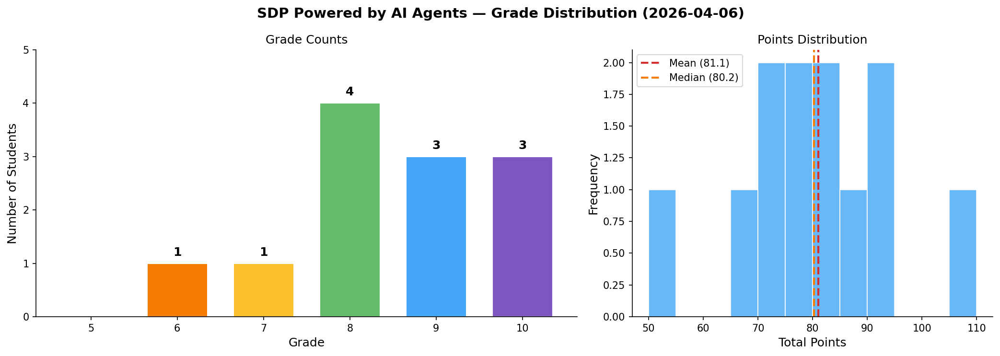

# Grades — SDP Powered by AI Agents (2026-04-06)

## Student Grades

| ID   | Coursework (/70) | Test (/30) | Total (/100) | Grade |
| ---- | ---------------- | ---------- | ------------ | ----- |
| 50FC | 60               | 22.5       | 82.5         | 9     |
| 4B2F | 65               | 24         | 89           | 9     |
| AA38 | 80               | 27         | 107          | 10    |
| BF1B | 56               | 25.5       | 81.5         | 9     |
| 41AA | 58               | 15         | 73           | 8     |
| 2588 | 43               | 25.5       | 68.5         | 7     |
| A563 | 55               | 19.5       | 74.5         | 8     |
| 2D42 | 55               | 24         | 79           | 8     |
| A095 | 70               | 22.5       | 92.5         | 10    |
| 2A3F | 66               | 27         | 93           | 10    |
| 1793 | 56               | 22.5       | 78.5         | 8     |
| BF02 | 39               | 15         | 54           | 6     |

## Grading Breakdown (100 pts total)

| Component        | Points | Details                              |
| ---------------- | ------ | ------------------------------------ |
| Coursework       | 70     | Modules (5 × 5 pts) + Project (45)  |
| Test             | 30     | Written/practical exam               |

## Grade Distribution

| Grade | Count | Students              |
| ----- | ----- | --------------------- |
| 10    | 3     | AA38, A095, 2A3F      |
| 9     | 3     | 50FC, 4B2F, BF1B      |
| 8     | 4     | 41AA, A563, 2D42, 1793 |
| 7     | 1     | 2588                  |
| 6     | 1     | BF02                  |

**Statistics (n=12)**

| Metric    | Value |
| --------- | ----- |
| Mean      | 81.0  |
| Median    | 80.8  |
| Std Dev   | 13.0  |
| Min       | 54.0  |
| Max       | 107.0 |

