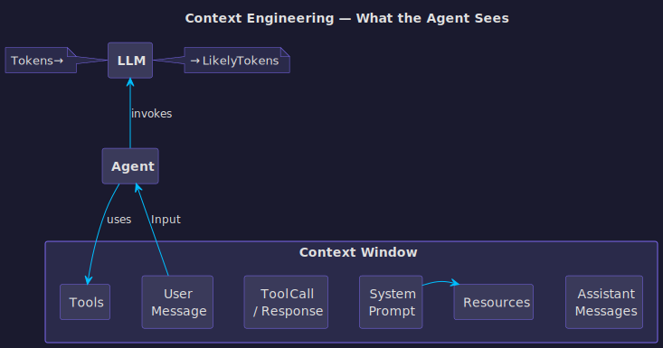
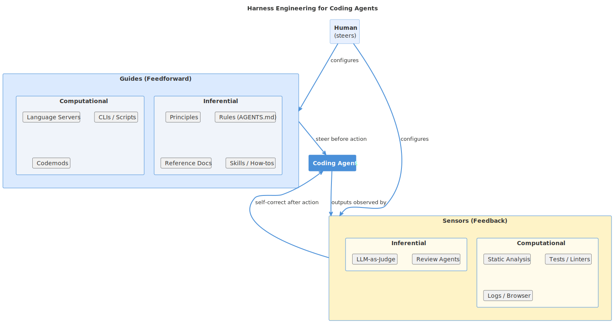

# Course Introduction

## Slide 1: Intro
**Type:** title
**Content:**
Intro
Software Development Processes Powered by AI Agents

**Notes:**
Welcome to the course. Over the next three weeks, you'll learn the core processes of professional software development — and build AI agents that automate each one.
This is not a course about using AI to write code for you. It's about understanding the processes deeply enough to teach them to an agent.

---

## Slide 2: The Big Idea
**Type:** storytelling
**Content:**
Software development is more than writing code. It's a chain of processes — planning, designing, specifying, building, testing, deploying, reviewing. Each process has conventions, templates, and rules. Humans follow them manually, often inconsistently. AI agents can follow them precisely, every time — but only if you engineer the right context and constraints around them. That's what this course teaches you to do.

**Notes:**
The key insight is that AI agents are only as good as the processes you encode into them. A coding agent without architecture guidelines produces inconsistent code. An agent without commit conventions produces unreadable history. An agent without test requirements produces untested features.
Your job is to learn each process, then encode it into an agent that follows it reliably.

---

## Slide 3: What You'll Build
**Type:** content
**Content:**
- What You'll Build
- **Module 1: Git Agent** — issues, branches, commits, PRs
- **Module 2: Architecture Agent** — arc42 docs, C4 diagrams, ADRs
- **Module 3: Requirements Agent** — user stories, DDD, Pareto prioritization
- **Module 4: CI/CD Agent** — GitHub Actions, SAM deploy, test gates
- **Module 5: TDD/BDD Agent** — multi-agent test system (RED-GREEN-REFACTOR)
- **Module 6: FitTrack** — team project using all 5 agents end-to-end

**Notes:**
Five individual modules, each producing one specialized agent. Then a team capstone where you combine all five agents to build a real serverless application.
Each module follows the same pattern: learn the process, practice it manually, then build an agent that automates it.

---

## Slide 4: 🔄
**Type:** big_number
**Content:**
🔄
The Pattern
Learn the process → Practice manually → Build an agent → Use the agent
This cycle repeats for every module.

**Notes:**
This is the rhythm of the course. You can't automate what you don't understand. That's why we always start with theory and manual practice before building the agent.
By Module 6, you'll have five agents that work together. The Git agent creates issues and PRs. The architecture agent designs the system. The requirements agent derives stories. The TDD agent implements them. The CI/CD agent deploys.

---

## Slide 5: Part 1
**Type:** section
**Content:**
Part 1
Context Engineering

**Notes:**
Before we dive into the modules, let's understand two foundational concepts that underpin everything we'll do: context engineering and harness engineering.

---

## Slide 6: What Is Context Engineering?
**Type:** storytelling
**Content:**
An LLM takes tokens in and produces likely tokens out. That's all it does. An agent wraps the LLM in a loop — it takes input, calls the LLM, uses tools, and repeats. But the quality of the agent's output depends entirely on what's in its context window. Context engineering is the discipline of controlling what goes into that window: the system prompt, resources, tools, user messages, assistant messages, and tool call responses. Get the context right, and the agent produces excellent results. Get it wrong, and no amount of model intelligence saves you.

**Notes:**
This is the most important concept in the course. The model is fixed — you can't change how Claude or Nova works. But you can change everything around it. The system prompt tells the agent who it is and what rules to follow. Resources give it reference material. Tools give it capabilities. The user message gives it the task.
Context engineering is about being deliberate with all of these. Not just throwing everything in and hoping for the best, but carefully selecting what the agent needs for each task.

---

## Slide 7: The Context Window
**Type:** image
**Content:**

**Notes:**
This diagram shows the two levels. At the top, the LLM level: tokens in, likely tokens out. Below that, the agent level: input triggers the agent, which uses tools and calls the LLM in a loop.
The bottom section is the context window — everything the LLM sees when it generates a response. System prompt sets the rules. Resources provide reference material. Tools define capabilities. User message is the task. Assistant messages are the conversation history. Tool call responses are results from previous tool use.
When you build a Kiro CLI agent, you're engineering this context. The agent JSON config defines the system prompt, tools, and resources. That's context engineering.

---

## Slide 8: Context = Agent Quality
**Type:** content
**Content:**
- Context Engineering in Practice
- **System Prompt** — who the agent is, what rules it follows
- **Resources** — reference docs, templates, examples loaded at start
- **Tools** — capabilities: `fs_read`, `fs_write`, `shell`, MCP servers
- **User Message** — the task, with enough detail to act on
- **Conversation History** — what the agent remembers from this session
- **Tool Responses** — results from previous actions (file contents, CLI output)

**Notes:**
Every Kiro CLI agent config you build in this course is a context engineering exercise. The prompt field is the system prompt. The resources field loads reference docs. The tools field grants capabilities.
The quality of your agent is directly proportional to the quality of its context. A vague system prompt produces vague results. A precise system prompt with templates and examples produces precise results.

---

## Slide 9: Part 2
**Type:** section
**Content:**
Part 2
Harness Engineering

**Notes:**
Context engineering tells us what to put in the agent's window. Harness engineering tells us how to keep the agent on track — preventing mistakes before they happen and catching them when they do.

---

## Slide 10: What Is Harness Engineering?
**Type:** storytelling
**Content:**
A harness is everything around the model that keeps it on track. For coding agents, the harness has two parts: guides that steer the agent before it acts, and sensors that detect problems after it acts. Guides are feedforward controls — they increase the probability of good results on the first attempt. Sensors are feedback controls — they let the agent self-correct before issues reach human eyes. The human's job is to steer by iterating on both.

**Notes:**
This concept comes from Birgitta Böckeler at Thoughtworks, published on martinfowler.com in April 2026. The key insight is that Agent equals Model plus Harness. You can't change the model, but you can engineer the harness.
Think of it like guardrails on a highway. The guides are the lane markings — they keep you in the right lane. The sensors are the rumble strips — they alert you when you drift. Together, they make the highway safe without requiring constant attention.

---

## Slide 11: Harness Overview
**Type:** image
**Content:**

**Notes:**
This diagram shows the full picture. The human steers by configuring guides and sensors. Guides feed forward into the coding agent — principles, rules, reference docs, language servers, scripts. Sensors observe the agent's output — static analysis, tests, linters, review agents.
The critical distinction is computational versus inferential. Computational controls are deterministic and fast — linters, type checkers, tests. Inferential controls use AI — review agents, LLM-as-judge. You want both, but computational controls are cheaper and more reliable.

---

## Slide 12: Guides and Sensors
**Type:** content
**Content:**
- Guides and Sensors
- **Guides (Feedforward)** — steer before the agent acts
  - Inferential: AGENTS.md, skills, principles, reference docs
  - Computational: language servers, CLIs, scripts, codemods
- **Sensors (Feedback)** — detect and self-correct after the agent acts
  - Computational: static analysis, linters, tests, logs
  - Inferential: review agents, LLM-as-judge

**Notes:**
In this course, you'll build both. The agent configs with their system prompts and resources are guides — they steer the agent before it acts. The pre-commit hooks from Module 1 are computational sensors — they catch problems after the agent writes code.
When you add a rule to your agent's prompt saying "always use conventional commits", that's a guide. When the commit-msg hook rejects a badly formatted commit, that's a sensor. Together, they form the harness.

---

## Slide 13: 🔗
**Type:** big_number
**Content:**
🔗
Harness = Guides + Sensors
Guides prevent mistakes. Sensors catch what guides miss.
The human steers by improving both over time.

**Notes:**
This is the mental model for the entire course. Every module adds to your harness. Module 1 adds Git conventions as guides and pre-commit hooks as sensors. Module 2 adds architecture templates as guides and PlantUML validation as sensors. Module 5 adds test naming conventions as guides and pytest as sensors.
By Module 6, you have a comprehensive harness that keeps your agents producing high-quality, consistent output.

---

## Slide 14: This Course Is a Harness
**Type:** content
**Content:**
- This Course Is a Harness
- **Module 1 (Git):** commit conventions = guide, pre-commit hooks = sensor
- **Module 2 (Architecture):** arc42 template = guide, PlantUML validation = sensor
- **Module 3 (Requirements):** story format = guide, traceability check = sensor
- **Module 4 (CI/CD):** deploy pipeline = guide, test gate = sensor
- **Module 5 (TDD):** test naming = guide, pytest RED/GREEN = sensor
- Each module adds guides and sensors to your agent harness

**Notes:**
Now you see why the course is structured this way. Each module teaches you a software development process and the corresponding harness controls. By the end, your agents have a rich set of guides telling them what to do and sensors catching when they drift.
This is exactly how professional teams work with coding agents. The difference is that you're building the harness from scratch, so you understand every piece of it.

---

## Slide 15: Part 3
**Type:** section
**Content:**
Part 3
Course Structure

**Notes:**
Let's look at the practical structure — timeline, tools, and how the modules connect.

---

## Slide 16: 3-Week Timeline
**Type:** content
**Content:**
- 3-Week Timeline
- **Days 1–2:** Module 1 — Git (agent + exercise)
- **Days 3–4:** Module 2 — Architecture (agent + kata design)
- **Days 5–6:** Module 3 — Requirements (agent + kata stories)
- **Days 7–8:** Module 4 — CI/CD (agent + pipeline exercise)
- **Days 9–12:** Module 5 — TDD/BDD (multi-agent system + kata implementation)
- **Days 13–18:** Module 6 — FitTrack (team project, all agents)
- **Days 19–21:** Buffer, presentations, retrospective

**Notes:**
Modules 1 through 5 are individual work. You build your own agents, choose your own kata, and submit PRs for review.
Module 6 is team work. You form teams and use all five agents together to build FitTrack, a serverless fitness tracker. This is where everything comes together.

---

## Slide 17: Prerequisites
**Type:** content
**Content:**
- Prerequisites
- **GitHub account** (free)
- **Kiro CLI** installed (kiro.dev)
- **Python 3.12+**, **Node 20**, **AWS SAM CLI**
- **Git** and **GitHub CLI** (`gh`)
- Basic knowledge of Python, REST APIs, and React
- AWS student sandbox account (for Module 4+)

**Notes:**
Module 1 walks you through setting up everything. If you don't have a GitHub account, you'll create one. If you don't have the tools installed, the module guides you through it.
The AWS sandbox is only needed from Module 4 onwards. We'll set that up when we get there.

---

## Slide 18: Agents Build on Each Other
**Type:** content
**Content:**
- Agents Build on Each Other
- Module 1: **Git Agent** — used in every subsequent module for commits and PRs
- Module 2: **Architecture Agent** — output feeds into Module 3
- Module 3: **Requirements Agent** — output feeds into Module 5
- Module 4: **CI/CD Agent** — used in Module 6 for deployment
- Module 5: **TDD Agent** — used in Module 6 for implementation
- Module 6: **All agents together** on one project

**Notes:**
This is not a collection of independent modules. Each agent builds on the previous ones. The Git agent is your workhorse — you use it in every module to create issues, branches, and PRs.
The architecture agent's output becomes the input for the requirements agent. The requirements agent's output becomes the input for the TDD agent. It's a pipeline, just like real software development.

---

## Slide 19: 🎯
**Type:** big_number
**Content:**
🎯
Key Takeaway
You're not learning to use AI. You're learning software development processes — and encoding them into agents that follow those processes precisely.

**Notes:**
This is what separates this course from a typical "AI tools" workshop. You'll understand Git workflows, architecture documentation, requirements engineering, CI/CD pipelines, and test-driven development at a deep level. The agents are the vehicle for that understanding, not the destination.
Let's get started with Module 1.
