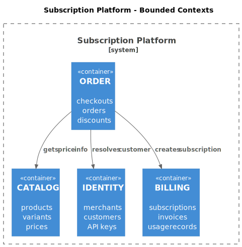
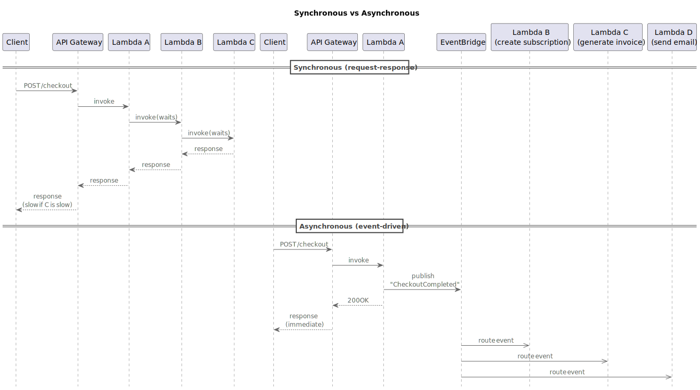
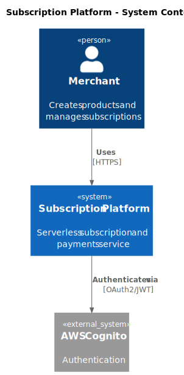
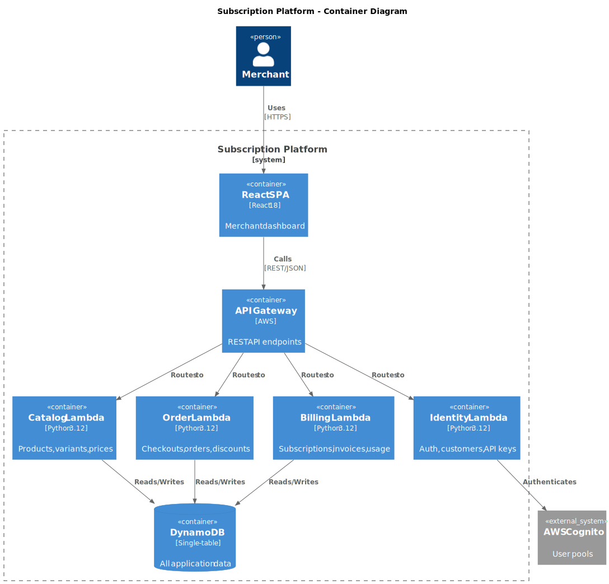

# Module 2: Software Architecture

## Slide 1: Module 2: Software Architecture
**Type:** title
**Content:**
Module 2: Software Architecture
Software Development Processes Powered by AI Agents

**Notes:**
Welcome to Module 2. Today we cover software architecture — the decisions you make before writing code that are expensive to change later.
By the end of this module you'll understand DDD, serverless, event-driven architecture, arc42, and C4. And you'll build an agent that generates architecture documents for you.

---

## Slide 2: What You'll Learn
**Type:** content
**Content:**
- What You'll Learn
- Understand why architecture decisions must happen before coding
- Know the key principles: DDD, microservices, serverless, EDA
- Use the arc42 template to document software architecture
- Use the C4 model to create diagrams at multiple zoom levels
- Write PlantUML diagrams as code with pre-commit auto-generation
- Build a Kiro CLI agent that generates architecture documents

**Notes:**
Same pattern as Module 1: learn the process, then automate it with an agent.
Architecture is the most important phase to get right because these decisions are the hardest to reverse. Changing your database from SQL to NoSQL after six months of development is a rewrite. Deciding upfront is a conversation.

---

## Slide 3: Part 1
**Type:** section
**Content:**
Part 1
What Is Software Architecture?

**Notes:**
Let's start with the fundamentals. What is architecture, and why should you care about it before writing a single line of code?

---

## Slide 4: What Is Software Architecture?
**Type:** content
**Content:**
- What Is Software Architecture?
- The set of decisions that are **expensive to change later**
- How the system is decomposed into components
- How those components communicate
- Where data is stored and how it flows
- What technologies are used and **why**
- What quality attributes are prioritized

**Notes:**
Architecture is not about getting everything right upfront. It's about making the hard-to-reverse decisions deliberately and documenting them.
Easy-to-change decisions — like which HTTP library to use or how to format a date — those can wait for implementation. But the database engine, the communication pattern between services, the deployment model — those are architecture decisions.

---

## Slide 5: Why Architecture Matters
**Type:** content
**Content:**
- Why Architecture Matters
- **Shared vocabulary** — team speaks the same language about components
- **Constraint alignment** — everyone knows what technologies to use and why
- **Quality assurance** — latency, cost, scale addressed early
- **Onboarding speed** — new developers understand the system from docs
- **Change management** — impact of changes is predictable

**Notes:**
Without architecture, Developer A builds a REST API with PostgreSQL, Developer B builds GraphQL with MongoDB, Developer C builds gRPC with Redis. Three incompatible services, no shared patterns, integration nightmare.
With architecture, you decide upfront: all services use REST, DynamoDB, EventBridge. Consistent patterns, shared tooling, predictable integration.

---

## Slide 6: ⚠️
**Type:** big_number
**Content:**
⚠️
Without Architecture
Developer A: REST + PostgreSQL
Developer B: GraphQL + MongoDB
Developer C: gRPC + Redis
Three incompatible services. Integration nightmare.

**Notes:**
This is what happens in real teams when there's no architecture. Everyone makes their own technology choices. Six months later, you have three services that can't talk to each other, three different deployment pipelines, and three different monitoring setups.
Architecture prevents this by making the key decisions once, documenting them, and ensuring everyone follows them.

---

## Slide 7: Part 2
**Type:** section
**Content:**
Part 2
Domain-Driven Design

**Notes:**
Now let's talk about how to decompose a system. DDD gives us the tools to think about this clearly.

---

## Slide 8: Domain-Driven Design (DDD)
**Type:** content
**Content:**
- Domain-Driven Design (DDD)
- Focus on the **business domain**, not technical concerns
- **Bounded Context** — a boundary with its own model and language
- **Entity** — object with identity that persists (User, Session)
- **Value Object** — defined by attributes, no identity (Weight, Date)
- **Aggregate** — cluster of entities treated as a unit (Session + Exercises)
- **Domain Event** — something that happened ("Workout Logged", "PR Achieved")

**Notes:**
DDD is about organizing your software around the business problem, not around technical layers. Instead of thinking "I need a database layer, a service layer, and an API layer", you think "I have an AUTH domain, a WORKOUT domain, and a PROGRESS domain."
Each domain has its own language. In AUTH, a User is credentials and tokens. In WORKOUT, a User is sessions and exercises. These are different models, and that's fine — that's what bounded contexts are for.

---

## Slide 9: Bounded Contexts
**Type:** image
**Content:**


**Notes:**
Here's the Subscription Platform decomposed into four bounded contexts. CATALOG handles products and pricing. IDENTITY handles merchant auth and customer management. ORDER handles checkouts, payments, and discounts. BILLING handles subscription lifecycle, invoicing, and usage tracking.
Each context has its own model, its own Lambda functions, and its own section of the DynamoDB table. They communicate through REST calls between modules.

---

## Slide 10: Part 3
**Type:** section
**Content:**
Part 3
Microservices, Serverless, and EDA

**Notes:**
Now let's talk about how these bounded contexts become real services, and how they communicate.

---

## Slide 11: Microservices vs Serverless
**Type:** content
**Content:**
- Microservices vs Serverless
- **Microservices** — small, independently deployable services
- **Serverless** — no servers to manage, pay per execution
- Serverless = microservices taken to the extreme
  - Per-function deployment instead of per-service
  - Per-function scaling instead of per-service
  - **Scales to zero** — $0 when nobody is using it

**Notes:**
Microservices decompose a system into small services. Serverless takes this further — you don't manage servers at all. AWS Lambda runs your code on demand and charges per execution.
The killer feature is scales to zero. When nobody is using your app, you pay nothing. When traffic spikes, Lambda scales automatically. This is why serverless is perfect for MVPs, student projects, and variable workloads.

---

## Slide 12: 💰
**Type:** big_number
**Content:**
💰
Scales to Zero
No traffic = $0. Spike to 10,000 requests = auto-scales.
No servers to manage, no capacity planning, no idle costs.

**Notes:**
This is the economic argument for serverless. A traditional server costs money 24/7 whether anyone is using it or not. With Lambda, you pay only for the milliseconds your code actually runs.
For a student project on AWS free tier, this means you can deploy a real application and pay essentially nothing. For a startup, it means you don't burn money on infrastructure before you have customers.

---

## Slide 13: AWS Serverless Stack
**Type:** content
**Content:**
- AWS Serverless Stack
- **Lambda** — compute (run code on demand)
- **API Gateway** — HTTP endpoints
- **DynamoDB** — NoSQL database (on-demand billing)
- **Cognito** — authentication (user pools, JWT)
- **EventBridge** — event routing between services
- **S3 + CloudFront** — frontend hosting and CDN
- **SAM** — Infrastructure as Code for serverless

**Notes:**
This is the stack we'll use for the Subscription Platform. Every component scales to zero and is fully managed. No servers, no patching, no capacity planning.
SAM — Serverless Application Model — is how we define all of this as code. One YAML file describes your Lambda functions, API Gateway, DynamoDB tables, and all the wiring between them.

---

## Slide 14: Event-Driven Architecture (EDA)
**Type:** content
**Content:**
- Event-Driven Architecture (EDA)
- Services communicate through **events**, not direct calls
- Events are **asynchronous** — producer doesn't wait for consumer
- Events are **past tense**: "CheckoutCompleted", "SubscriptionCreated"
- **Loose coupling** — services don't know about each other
- **Resilience** — one service failure doesn't cascade

**Notes:**
In traditional architecture, services call each other directly. If the downstream service is slow or down, the caller fails too. In EDA, services publish events and move on. Consumers process events independently.
This is a fundamental shift. Instead of "call the billing service to create a subscription", you publish a "CheckoutCompleted" event. The subscription creator, the invoice generator, and the email notifier all react independently. If one fails, the others still succeed.

---

## Slide 15: Sync vs Async
**Type:** image
**Content:**


**Notes:**
Look at the difference. In the synchronous model, the user waits for the entire chain. If Lambda C takes 5 seconds, the user waits 5 seconds.
In the event-driven model, Lambda A completes the checkout and publishes an event. The user gets a response immediately. The subscription creation, invoice generation, and email notification happen in the background. If the email sender fails, the subscription is still created.

---

## Slide 16: EDA Principles
**Type:** content
**Content:**
- EDA Principles
- **Event naming** — past tense: "CheckoutCompleted", not "CompleteCheckout"
- **Idempotency** — processing same event twice = same result
- **Error handling** — Dead Letter Queues for failed events
- **Schema validation** — events have defined, versioned schemas
- **Retry with backoff** — exponential delays on failure

**Notes:**
These principles are non-negotiable in production EDA systems. Idempotency means if an event is delivered twice — which happens in distributed systems — your handler produces the same result. No duplicate records, no double-counting.
Dead Letter Queues catch events that fail after all retries. Instead of losing the event, it goes to a DLQ where you can inspect and replay it.

---

## Slide 17: Part 4
**Type:** section
**Content:**
Part 4
Documenting Architecture: arc42 and C4

**Notes:**
Now that we understand the principles, let's talk about how to document them. arc42 gives us the structure, C4 gives us the diagrams.

---

## Slide 18: The arc42 Template
**Type:** content
**Content:**
- The arc42 Template — 12 Chapters
- **Ch 1–2:** Goals, constraints — why and what limits
- **Ch 3:** Context and scope — system boundary (C4 Level 1)
- **Ch 4:** Solution strategy — key technology decisions
- **Ch 5:** Building blocks — decomposition (C4 Level 2–3)
- **Ch 6–7:** Runtime and deployment views
- **Ch 8:** Cross-cutting concepts — auth, logging, errors
- **Ch 9:** Architecture decisions (ADRs)
- **Ch 10–12:** Quality, risks, glossary

**Notes:**
arc42 is a template, not a methodology. It tells you what to document, not how to design. The 12 chapters cover everything from business goals to technical risks.
You don't need to fill every chapter equally. For an MVP, chapters 3, 5, and 9 are the most important — system boundary, building blocks, and decisions. Chapters 10-12 can be brief.

---

## Slide 19: The C4 Model
**Type:** content
**Content:**
- The C4 Model — 4 Levels of Zoom
- **Level 1: System Context** — your system + users + external systems
- **Level 2: Container** — APIs, databases, frontends, message buses
- **Level 3: Component** — classes, modules, Lambda functions
- **Level 4: Code** — class diagrams (rarely needed)
- Each level answers a different question at a different audience

**Notes:**
C4 is like Google Maps for architecture. Level 1 is the country view — who uses the system and what does it connect to. Level 2 is the city view — what are the major technical building blocks. Level 3 is the street view — what's inside each building block.
Level 4 is rarely needed. If your code is well-structured, the code itself is the documentation at that level.

---

## Slide 20: C4 Level 1 — System Context
**Type:** image
**Content:**


**Notes:**
This is the simplest diagram. One box for your system, surrounded by the people who use it and the external systems it talks to.
For the Subscription Platform: a merchant interacts with the platform to create products and manage subscriptions, which authenticates via AWS Cognito. That's it at Level 1. Simple, clear, fits on a napkin.

---

## Slide 21: C4 Level 2 — Container
**Type:** image
**Content:**


**Notes:**
Now we zoom in. The Subscription Platform contains a React SPA, an API Gateway, Lambda functions, and a DynamoDB table. Each of these is a container — a separately deployable unit.
This is the diagram that developers look at most. It shows the major technical building blocks and how they connect.

---

## Slide 22: PlantUML — Diagrams as Code
**Type:** content
**Content:**
- PlantUML: Diagrams as Code
- Write diagrams in text format → compile to SVG/PNG
- Versioned in Git alongside your code
- C4 library available: `C4_Context.puml`, `C4_Container.puml`
- **Pre-commit hook** auto-generates SVGs from `.puml` files
- No manual diagram generation — commit `.puml`, get `.svg`

**Notes:**
This is the everything-as-code principle from Module 1 applied to diagrams. You write PlantUML in a text file, commit it, and the pre-commit hook generates the SVG automatically.
No more Visio files that nobody can edit. No more screenshots that go stale. The diagram source is code, versioned with everything else.

---

## Slide 23: PlantUML Example
**Type:** code
**Content:**
```plantuml
@startuml c4-context
!include C4_Context.puml

title Subscription Platform - System Context

Person(user, "Merchant", "Manages products and subscriptions")
System(subplatform, "Subscription Platform", "Payments service")
System_Ext(cognito, "AWS Cognito", "Auth")

Rel(user, subplatform, "Uses", "HTTPS")
Rel(subplatform, cognito, "Auth via", "JWT")
@enduml
```

**Notes:**
This is what a C4 diagram looks like in PlantUML. Person, System, System_Ext, and Rel are all from the C4 library. You include the library, define your elements, define relationships, and PlantUML renders it.
The @startuml directive name must match the filename — c4-context.puml starts with @startuml c4-context. This is required for the pre-commit hook to work correctly.

---

## Slide 24: Architecture Decision Records
**Type:** content
**Content:**
- Architecture Decision Records (ADRs)
- Documents a single decision with context and consequences
- Lives in arc42 Chapter 9
- Format: **Status**, **Context**, **Decision**, **Rationale**, **Consequences**
- Captures **why**, not just what
- Six months later: "Why DynamoDB?" → ADR has the answer

**Notes:**
ADRs are one of the most valuable things you can write. They capture the reasoning behind decisions. Code tells you what was built. ADRs tell you why it was built that way.
Without ADRs, someone joins the team six months later and asks "why did we use DynamoDB instead of PostgreSQL?" Nobody remembers. With an ADR, the answer is documented: scales to zero, no connection pooling, fits serverless model, on-demand billing.

---

## Slide 25: ADR Example
**Type:** code
**Content:**
```markdown
## ADR-001: Use DynamoDB Single-Table Design

**Status:** Accepted

**Context:**
The Subscription Platform needs a database. We need fast reads,
low cost, and serverless scaling.

**Decision:**
Use DynamoDB with single-table design.

**Rationale:**
- Scales to zero (on-demand billing)
- Single-digit ms latency
- No connection pooling needed
- Fits serverless model perfectly

**Consequences:**
- Access patterns must be designed upfront
- Less flexible queries than SQL
```

**Notes:**
Short, clear, and to the point. Context explains the problem. Decision states the choice. Rationale explains why. Consequences are honest about tradeoffs.
Notice the consequences section isn't all positive. Good ADRs acknowledge tradeoffs. DynamoDB means you need to design access patterns upfront and queries are less flexible. That's the price you pay for the benefits.

---

## Slide 26: Part 5
**Type:** section
**Content:**
Part 5
Exercises

**Notes:**
Time to put this into practice. First you'll choose a coding kata, then build an architecture agent and use it to design the architecture for your kata.

---

## Slide 27: Coding Dojo Kata Catalogue
**Type:** content
**Content:**
- Coding Dojo Kata Catalogue
- A **kata** is a small programming exercise for deliberate practice
- Term from martial arts — repeat until it becomes second nature
- https://codingdojo.org/kata/ — dozens of katas, simple to complex
- **Choose one kata** for this module and all following modules
- Good choices: BankOCR, Minesweeper, Game of Life, Bowling, Mars Rover
- Pick one with enough complexity for 2–3 bounded contexts

**Notes:**
The Coding Dojo is a community-driven collection of programming exercises. Each kata has a clear problem statement and constraints — perfect for practicing software development processes.
You'll choose one kata now and use it through the rest of the course. In this module you architect it. In Module 3 you derive user stories. In Module 5 you implement it with TDD. Pick something that interests you and has enough moving parts to make the architecture meaningful.

---

## Slide 28: Exercise Part 1
**Type:** content
**Content:**
- Exercise Part 1: Manual
- Study arc42 template at arc42.org/overview
- Study C4 model at c4model.com
- Set up PlantUML pre-commit hook for auto SVG generation
- Write a C4 Context diagram for your chosen kata
- Write ADR-001: technology stack decision

**Notes:**
Start with the manual work. Read the arc42 and C4 references. Then set up the PlantUML pre-commit hook so diagrams are generated automatically.
Write your first diagram and your first ADR for your chosen kata. This gives you the hands-on understanding you need before building the agent.

---

## Slide 29: Exercise Part 2
**Type:** content
**Content:**
- Exercise Part 2: Architecture Agent
- Build `.kiro/agents/architecture-agent.json`
- Agent generates arc42 chapters as separate `.md` files
- Agent produces PlantUML C4 diagrams
- Agent works chapter by chapter (waits for approval)
- Use it to design your kata architecture (all 12 chapters)
- Commit, PR via Git agent, add instructor as reviewer

**Notes:**
The agent should generate one chapter at a time and wait for your approval. Architecture is a conversation, not a one-shot generation. You review each chapter, give feedback, and the agent refines.
The starter config gives you the workflow. You need to add the C4 templates, ADR format, and architectural principles. That's the learning exercise.
Remember: add the instructor as reviewer on your PR before merging.

---

## Slide 30: 🎯
**Type:** big_number
**Content:**
🎯
Key Takeaway
Architecture = decisions that are expensive to change later.
Document them with arc42. Visualize them with C4. Version them with Git.

**Notes:**
Architecture is not about perfection. It's about making the hard decisions deliberately, documenting them so the team is aligned, and versioning everything so you can trace how the system evolved.
Next module, we'll take this architecture and derive user stories from it — breaking down the system into implementable pieces using Domain-Driven Design and Pareto prioritization.
