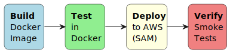

# Module 4: CI/CD

## Table of Contents

- [Learning Objectives](#learning-objectives)
- [1. Theory: Continuous Integration and Continuous Delivery](#1-theory-continuous-integration-and-continuous-delivery)
  - [1.1 Why CI/CD?](#11-why-cicd)
  - [1.2 Continuous Integration](#12-continuous-integration)
  - [1.3 Continuous Delivery vs. Continuous Deployment](#13-continuous-delivery-vs-continuous-deployment)
  - [1.4 GitHub Actions Fundamentals](#14-github-actions-fundamentals)
  - [1.5 Docker in CI/CD](#15-docker-in-cicd)
  - [1.6 Pipeline Design: Build → Test → Deploy](#16-pipeline-design-build--test--deploy)
  - [1.7 OIDC Federation: No Secrets in the Repo](#17-oidc-federation-no-secrets-in-the-repo)
  - [1.8 Pipeline as Code — The Harness Sensor](#18-pipeline-as-code--the-harness-sensor)
- [2. Exercise Part 1: Understand CI/CD Pipelines](#2-exercise-part-1-understand-cicd-pipelines)
- [3. Exercise Part 2: Build and Use the CI/CD Agent](#3-exercise-part-2-build-and-use-the-cicd-agent)
- [References](#references)

## Learning Objectives

By the end of this module you will:

- Understand the difference between CI, CD, and continuous deployment
- Know how GitHub Actions workflows, jobs, and steps work
- Write a Dockerfile that builds and tests your kata
- Design a pipeline that builds a Docker image and runs tests on GitHub Actions
- Understand OIDC federation for keyless AWS deployments
- Build a Kiro CLI agent that generates CI/CD pipelines for your kata

## 1. Theory: Continuous Integration and Continuous Delivery

### 1.1 Why CI/CD?

In Module 1 you learned Git branching and PRs. In Module 2 you designed
the architecture. In Module 3 you derived user stories. Now you need a
way to **verify that every change works** before it reaches `main`.

Without CI/CD:

```text
Developer: "It works on my machine"
Reviewer: "Did you run the tests?"
Developer: "...most of them"
→ Broken main branch, manual testing, slow feedback
```

With CI/CD:

```text
Developer pushes to feature branch
→ GitHub Actions builds Docker image
→ Tests run automatically inside the container
→ PR shows ✅ or ❌ before anyone reviews
→ Merge only when green
```

CI/CD is the **ultimate harness sensor** — it automatically validates
every change against your test suite. No human has to remember to run
tests. The pipeline does it for you, every time, consistently.

### 1.2 Continuous Integration

Continuous Integration means every developer integrates their work
frequently — at least daily — and each integration is verified by an
automated build and test run.

**The CI contract:**

1. Every push triggers a build
2. Every build runs the full test suite
3. A broken build is the team's top priority to fix
4. The `main` branch is always in a deployable state

**Why "continuous"?** Because the longer you wait to integrate, the
harder it gets. A feature branch that lives for two weeks accumulates
merge conflicts, diverges from `main`, and becomes a merge nightmare.
CI forces small, frequent integrations that are easy to verify.

At BMW, we had **160,000 CI jobs per day** across the platform. That's
not overhead — that's the safety net that let 2,000+ developers work on
the same codebase without breaking each other's work.

### 1.3 Continuous Delivery vs. Continuous Deployment

These terms are often confused:

| Term | Meaning |
|------|---------|
| **Continuous Integration** | Every push is built and tested automatically |
| **Continuous Delivery** | Every green build *could* be deployed (manual trigger) |
| **Continuous Deployment** | Every green build *is* deployed automatically |

For this course, we practice **Continuous Delivery** — the pipeline
builds, tests, and prepares a deployment, but a human (you or the
instructor) decides when to deploy.

```text
Push → Build → Test → [Deploy to Staging] → Manual approval → Deploy to Prod
       ^^^^^^^^^^^^                          ^^^^^^^^^^^^^^^^
       Continuous Integration                Continuous Delivery
```

### 1.4 GitHub Actions Fundamentals

GitHub Actions is a CI/CD platform built into GitHub. Workflows are
defined in YAML files under `.github/workflows/`.

**Key concepts:**

| Concept | Description |
|---------|-------------|
| **Workflow** | A YAML file that defines the automation (`.github/workflows/*.yml`) |
| **Event** | What triggers the workflow (`push`, `pull_request`, `workflow_dispatch`) |
| **Job** | A set of steps that run on the same runner |
| **Step** | A single task — either a shell command (`run:`) or an action (`uses:`) |
| **Runner** | The machine that executes the job (`ubuntu-latest`) |
| **Action** | A reusable unit of code (`actions/checkout@v4`) |

**Anatomy of a workflow:**

```yaml
name: CI                          # Workflow name

on:                               # Trigger events
  push:
    branches: [main, 'feature/**']
  pull_request:
    branches: [main]

permissions:                      # Security: least privilege
  contents: read

jobs:                             # One or more jobs
  build-and-test:                 # Job ID
    runs-on: ubuntu-latest        # Runner
    steps:                        # Ordered list of steps
      - uses: actions/checkout@v4 # Step 1: checkout code
      - run: echo "Hello CI"      # Step 2: shell command
```

**Trigger filtering with `paths:`**

You can limit when a workflow runs based on which files changed:

```yaml
on:
  push:
    paths:
      - 'src/**'
      - 'tests/**'
      - 'Dockerfile'
      - '.github/workflows/ci.yml'
```

This means the pipeline only runs when relevant code changes — not when
you edit the README.

### 1.5 Docker in CI/CD

Docker solves the "works on my machine" problem. By building a Docker
image, you guarantee that the CI environment is identical to the
development environment.

**Why Docker in CI?**

1. **Reproducibility** — Same image, same results, everywhere
2. **Isolation** — Dependencies don't leak between projects
3. **Speed** — Cached layers make rebuilds fast
4. **Portability** — The image runs on any Docker host

**Dockerfile for a Python kata (example):**

```dockerfile
FROM python:3.12-slim

WORKDIR /app

# Install dependencies first (cached layer)
COPY requirements.txt .
RUN pip install --no-cache-dir -r requirements.txt

# Copy source code
COPY src/ src/
COPY tests/ tests/

# Run tests by default
CMD ["pytest", "tests/", "-v", "--tb=short"]
```

**Dockerfile for a C++ kata (from the TDD course):**

```dockerfile
FROM ubuntu:latest

RUN apt-get update && \
    apt-get install -y --no-install-recommends \
    build-essential cmake git ca-certificates && \
    apt-get clean && rm -rf /var/lib/apt/lists/*

RUN git clone https://github.com/google/googletest.git && \
    cd googletest && mkdir build && cd build && \
    cmake .. && cmake --build . --target install

WORKDIR /app
COPY . .

RUN mkdir -p build && cd build && cmake .. && cmake --build .
CMD ["./build/run_tests"]
```

**Key Dockerfile principles:**

- Order layers from least to most frequently changing
- `COPY requirements.txt` before `COPY src/` to cache dependency installs
- Use `--no-cache-dir` for pip to keep the image small
- Use multi-stage builds for compiled languages if the final image
  doesn't need build tools

### 1.6 Pipeline Design: Build → Test → Deploy

A well-designed pipeline has clear stages:



**For your kata, the pipeline should:**

1. **Build** — Build the Docker image from your Dockerfile
2. **Test** — Run tests inside the Docker container
3. **Report** — Show test results in the PR

**Example workflow for a kata:**

```yaml
name: CI

on:
  push:
    branches: [main, 'feature/**', 'fix/**']
  pull_request:
    branches: [main]

permissions:
  contents: read

jobs:
  build-and-test:
    runs-on: ubuntu-latest
    steps:
      - uses: actions/checkout@v4

      - name: Build Docker image
        run: docker build -t kata-tests .

      - name: Run tests
        run: docker run --rm kata-tests
```

That's it. Three steps. The Dockerfile encapsulates all the build logic
and dependencies. The workflow just builds and runs it.

### 1.7 OIDC Federation: No Secrets in the Repo

For the course project (Module 6), you'll deploy to AWS. Instead of
storing AWS access keys in GitHub Secrets (risky), we use **OIDC
federation** — GitHub Actions proves its identity to AWS, and AWS grants
temporary credentials.

```yaml
permissions:
  id-token: write   # Required for OIDC
  contents: read

steps:
  - uses: aws-actions/configure-aws-credentials@v4
    with:
      role-to-assume: arn:aws:iam::954728790990:role/GitHubActions-Course
      aws-region: eu-central-1
```

**How it works:**

1. GitHub Actions requests an OIDC token from GitHub's identity provider
2. The token is sent to AWS STS (Security Token Service)
3. AWS verifies the token and issues temporary credentials
4. The workflow uses those credentials — no long-lived keys anywhere

You don't need OIDC for Module 4 (kata testing only), but understanding
it prepares you for Module 6 deployment.

### 1.8 Pipeline as Code — The Harness Sensor

Remember from the intro: a **harness** has guides (feedforward) and
sensors (feedback). Your CI/CD pipeline is the most powerful sensor in
your development process.

| Harness Component | CI/CD Equivalent |
|-------------------|------------------|
| **Guide** (feedforward) | Branch protection rules, required checks |
| **Sensor** (feedback) | Test results, build status, code coverage |
| **Actuator** (action) | Block merge on failure, auto-deploy on success |

**Branch protection as a guide:**

```text
main branch rules:
  ✅ Require status checks to pass (CI must be green)
  ✅ Require PR reviews (at least 1 approval)
  ✅ No direct pushes to main
```

This means no code reaches `main` without passing the pipeline AND
getting a human review. The pipeline is the automated quality gate.

---

## 2. Exercise Part 1: Understand CI/CD Pipelines

### Goal

Analyze the CI/CD concepts and manually write a Dockerfile and GitHub
Actions workflow for your kata before automating it with an agent.

### Step 1: Write a Dockerfile for Your Kata

Create a `Dockerfile` in your kata's root directory that:

1. Starts from an appropriate base image for your kata's language
2. Installs dependencies
3. Copies source code and tests
4. Runs tests as the default command

Test it locally:

```bash
docker build -t my-kata .
docker run --rm my-kata
```

### Step 2: Write a GitHub Actions Workflow

> ⏳ **Note:** Steps 2 and 3 can only be fully verified after Module 5
> (TDD/BDD), when you have actual implementation and test code that
> triggers the CI pipeline.

Create `.github/workflows/ci.yml` that:

1. Triggers on push to `main` and `feature/**` branches
2. Triggers on pull requests to `main`
3. Builds the Docker image
4. Runs tests inside the container

### Step 3: Verify the Pipeline

Push your changes to a feature branch and verify:

- [ ] GitHub Actions workflow triggers
- [ ] Docker image builds successfully
- [ ] Tests run and results appear in the Actions tab
- [ ] PR shows the check status (✅ or ❌)

---

## 3. Exercise Part 2: Build and Use the CI/CD Agent

### Goal

Build a Kiro CLI agent that reads your kata's project structure and
generates a Dockerfile and GitHub Actions CI pipeline.

### Step 1: Build the CI/CD Agent

Create `.kiro/agents/cicd-agent.json` using the starter template at
[starter/cicd-agent.json](starter/cicd-agent.json).

The agent must:

- Detect the kata's language and build system
- Generate a Dockerfile that builds and tests the kata
- Generate a `.github/workflows/ci.yml` pipeline
- Use Docker to encapsulate the build environment
- Follow GitHub Actions best practices (pinned action versions, least-privilege permissions)

### Step 2: Use the Agent to Generate the Pipeline

```bash
kiro-cli --tui --agent cicd-agent

> Read my kata project structure
> Generate a Dockerfile for building and testing
> Generate a GitHub Actions CI workflow
```

Review each generated file before approving. The agent should produce:

```text
Dockerfile                       ← Build + test container
.github/workflows/ci.yml        ← CI pipeline
```

### Step 3: Test the Pipeline Locally

> ⏳ **Note:** Steps 3 and 4 can only be fully verified after Module 5
> (TDD/BDD), when you have actual implementation and test code that
> triggers the CI pipeline.

Before pushing, verify the Docker build works:

```bash
docker build -t kata-tests .
docker run --rm kata-tests
```

Then configure the pre-commit hook so tests run automatically on every
commit. Copy `scripts/hooks/docker-test.sh` to your repo and add the
`docker-test` hook to your `.pre-commit-config.yaml`. Make a test commit
to verify the hook builds the image and runs tests before the commit
completes.

### Step 4: Push and Verify on GitHub

Push to a feature branch and verify:

- [ ] GitHub Actions workflow triggers automatically
- [ ] Docker image builds successfully in the pipeline
- [ ] Tests run and pass inside the container
- [ ] PR shows ✅ status check

### Step 5: Commit via Git Agent

```bash
kiro-cli --tui --agent git-agent

> Create a branch for the CI/CD issue
> Commit the Dockerfile and workflow
> Create a PR closing the CI/CD issue
```

### Step 6: Add Instructor as Reviewer and Merge

```bash
gh pr edit --add-reviewer momokrunic
```

Wait for approval, then merge:

```bash
gh pr merge --squash
```

### Acceptance Criteria

- [ ] Agent config exists at `.kiro/agents/cicd-agent.json`
- [ ] Agent detects kata language and build system
- [ ] Agent generates a working Dockerfile
- [ ] Agent generates `.github/workflows/ci.yml`
- [ ] Dockerfile builds and runs tests successfully (local)
- [ ] GitHub Actions pipeline triggers on push and PR
- [ ] Tests run inside Docker container in the pipeline
- [ ] PR shows ✅ status check from the CI workflow
- [ ] Pipeline committed and PR created via Git agent
- [ ] Instructor added as reviewer on PR

---

## References

- [GitHub Actions Documentation](https://docs.github.com/en/actions)
- [Dockerfile Reference](https://docs.docker.com/reference/dockerfile/)
- [GitHub Actions OIDC with AWS](https://docs.github.com/en/actions/security-for-github-actions/security-hardening-your-deployments/configuring-openid-connect-in-amazon-web-services)
- [Continuous Integration (Martin Fowler)](https://martinfowler.com/articles/continuousIntegration.html)
- [Continuous Delivery (Jez Humble)](https://continuousdelivery.com/)
- [Docker Best Practices](https://docs.docker.com/build/building/best-practices/)
- [Harness Engineering (Fowler)](https://martinfowler.com/articles/harness-engineering.html)
